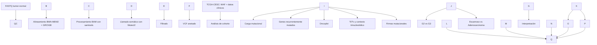

# Paisaje mutacional del cáncer cervicouterino

Proyecto de **Bioinformática I** orientado al análisis reproducible de variantes somáticas en cáncer cervicouterino.

## Pregunta biomédica

**¿Qué diferencias presenta el paisaje mutacional del cáncer cervicouterino según el grado tumoral (G2 vs G3) y el subtipo histológico (carcinoma escamoso vs adenocarcinoma), en términos de carga mutacional y genes recurrentemente alterados?**

## Conjuntos de datos

Se utilizarán dos conjuntos de datos complementarios:

### Dataset A: TCGA-CESC

Cohorte pública de cáncer cervicouterino obtenida desde **NCI Genomic Data Commons (GDC)**.

* 286 pacientes únicos.
* 287 archivos de mutaciones somáticas en formato MAF descargados.
* Para el análisis se utiliza un único MAF por paciente.
* Datos clínicos asociados para grado tumoral e histología.

Composición principal:

* G2: 126 pacientes.
* G3: 111 pacientes.
* Carcinoma escamoso: 236 pacientes.
* Adenocarcinoma: 46 pacientes.
* Otros: 4 pacientes.
* 

### Dataset B: E-MTAB-11407 / PRJEB50605

Subconjunto de datos WES de carcinoma escamoso cervicouterino con muestras tumor-normal pareadas.

Se seleccionaron tres pacientes para el desarrollo y prueba del pipeline:

|Paciente|Tumor|Normal|
|-|-|-|
|1094|ERR8314271|ERR8314261|
|755|ERR8314276|ERR8314265|
|999|ERR8314284|ERR8314269|

Cada muestra posee archivos FASTQ paired-end R1 y R2. En total se utilizarán **6 muestras y 12 archivos FASTQ**.

## Archivos principales

* `samplesheet/tcga\_cesc\_samplesheet.csv`: relación entre paciente, archivo MAF, grado tumoral e histología.
* `samplesheet/tcga\_cesc\_clinical\_clean.csv`: información clínica consolidada por paciente.
* `samplesheet/gdc\_original\_samplesheet.tsv`: samplesheet original descargado desde GDC.
* `samplesheet/cervical\_wes\_pipeline\_samplesheet.csv`: relación entre pacientes, muestras tumor-normal y FASTQ R1/R2.
* `data/tcga\_cesc/manifests/`: manifest utilizado para reproducir la descarga desde GDC.
* `data/cervical\_wes\_tumor\_normal/metadata/selected\_runs.tsv`: runs seleccionados para el pipeline.
* `data/cervical\_wes\_tumor\_normal/metadata/selected\_fastq\_urls.txt`: enlaces de descarga de los FASTQ seleccionados.

Los archivos genómicos de gran tamaño no se almacenarán en GitHub; el repositorio conservará los manifests, metadata, samplesheets y enlaces necesarios para reproducir su descarga.

## Workflow propuesto

## Genoma de referencia

Para el alineamiento se utilizará **GRCh38**.

Archivos preparados:

* `Homo\_sapiens\_assembly38.fasta`
* `Homo\_sapiens\_assembly38.fasta.fai`
* `Homo\_sapiens\_assembly38.dict`

## Código Nextflow

El workflow será implementado en **Nextflow DSL2**.

Archivos iniciales:

* `main.nf`
* `nextflow.config`
* `conf/params.yaml`
* `modules/`

El desarrollo parcial del pipeline incluirá procesos para control de calidad, alineamiento, procesamiento BAM, llamado de variantes somáticas, filtrado y anotación.

## Procedencia de los datos

### Dataset A

* NCI GDC TCGA-CESC: https://portal.gdc.cancer.gov/projects/TCGA-CESC
* GDC Data Portal: https://portal.gdc.cancer.gov/
* Documentación MAF: https://docs.gdc.cancer.gov/Data/File\_Formats/MAF\_Format/

### Dataset B

* BioStudies / ArrayExpress E-MTAB-11407: https://www.ebi.ac.uk/biostudies/arrayexpress/studies/E-MTAB-11407
* ENA PRJEB50605: https://www.ebi.ac.uk/ena/browser/view/PRJEB50605
* Publicación asociada: https://pmc.ncbi.nlm.nih.gov/articles/PMC5102491/

## Consideración importante

El Dataset B se utilizará únicamente para demostrar el procesamiento reproducible de un conjunto pequeño de pares tumor-normal mediante Nextflow. Las conclusiones sobre el paisaje mutacional y las comparaciones clínicas se realizarán utilizando la cohorte TCGA-CESC.

